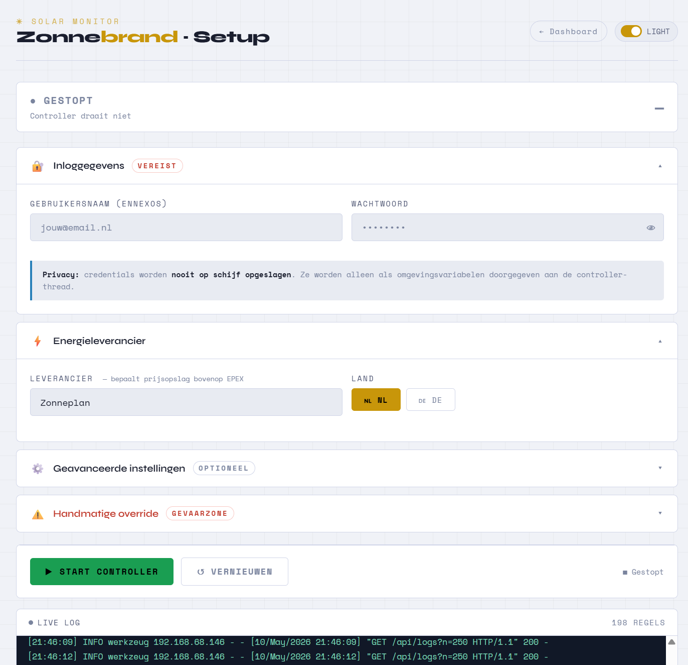
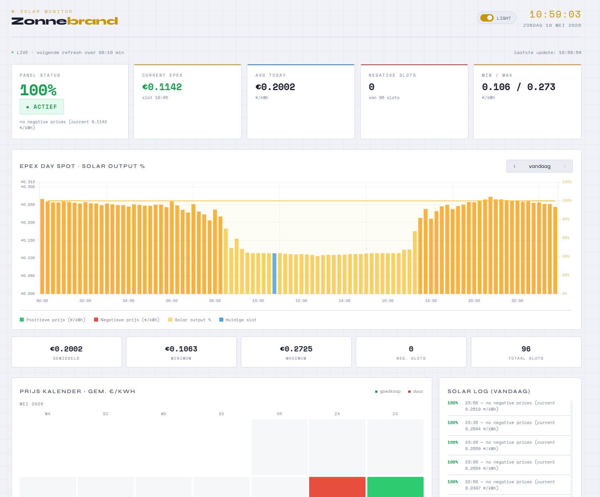

Server
=========

The **Zonnebrand Server** is a live web interface that visualises real-time
EPEX day-spot prices, solar panel output history, and the current inverter
status — all served locally from the same machine that runs ``zonnebrand``.

-----------------------------------

Launch
------

Start the dashboard server in a separate terminal (or as a background process):

.. code-block:: console

    python server.py

Then open your browser and go to:

.. code-block:: text

    http://localhost:8000
    http://192.168.XX.XXX:8000

To keep the dashboard running alongside ``zonnebrand``, you can start both processes in parallel, for example with ``tmux`` or ``screen``, or by using ``nohup``:

.. note::

    ``epex.csv`` and ``status.csv`` are created automatically the first time ``zonnebrand`` runs.  You do **not** need to create them manually.

.. tip::

    On a Raspberry Pi or home server, add both commands to ``/etc/rc.local``
    or create two ``systemd`` services so they start automatically on boot.

-----------------------------------

Setup
***************

The setup-dashboard is divided into various sections to setup your parameters and run the server.

   The Zonnebrand setup Dashboard to make the settings using user interface.

Dashboard
***************

The dashboard is divided into four areas.

   The Zonnebrand Dashboard, showing today's EPEX prices with the
   solar output overlay, the status cards, and the historic price calendar.

**Status cards** (top row)
    A live summary that refreshes every 60 seconds.

    - *Panel Status* — whether the inverter is at **100 %** (active) or
      **0 %** (curtailed) with the full decision reason from ``decide_target()``.
    - *Current EPEX* — the €/kWh price for the current 15-minute slot,
      coloured green when positive and red when negative.
    - *Avg Today* — the mean price across all slots seen so far today.
    - *Negative Slots* — how many of today's 96 slots carry a negative price.
    - *Min / Max* — the cheapest and most expensive slots of the day.

    An orange warning banner appears automatically when a negative price
    window is coming up later today.

**EPEX price chart with solar overlay** (main panel)
    A dual-axis bar + line chart covering a full day of 15-minute slots.

    - Green/yellow/orange bars show positive EPEX prices (€/kWh, left axis).
    - Red bars mark negative-price slots.
    - The current slot is highlighted in blue.
    - A yellow filled line shows the recorded solar output percentage from
      ``status.csv`` (right axis, 0 – 100 %).
    - Use the **‹** and **›** buttons to browse to any historical date that
      has been logged in ``epex.csv``.

**Price calendar heatmap** (bottom left)
    A monthly calendar where each day is coloured on a green → yellow → red
    scale according to its average EPEX price.  Days with a negative average
    are shown in dark red.  Click any cell to jump directly to that day in
    the main chart.

**Solar log** (bottom right)
    A reverse-chronological list of every decision logged in
    ``status.csv`` for the currently viewed day, showing the time,
    the target percentage, and the reason string.

-----------------------------------

Dark / light mode
-----------------

A toggle in the top-right corner of the header switches between the default
dark theme and a light theme.  The preference is saved in the browser's
``localStorage`` and restored automatically on the next visit.

-----------------------------------

Auto-refresh
------------

+------------------------+-----------------------------------+
| What refreshes         | Interval                          |
+========================+===================================+
| Status cards           | Every 60 seconds                  |
+------------------------+-----------------------------------+
| Full chart + log       | Every 15 minutes                  |
+------------------------+-----------------------------------+
| Countdown timer        | Visible in the top bar            |
+------------------------+-----------------------------------+

New data written to the CSV files by ``zonnebrand`` is picked up
automatically on the next scheduled refresh — no server restart required.

-----------------------------------

.. include:: add_bottom.add